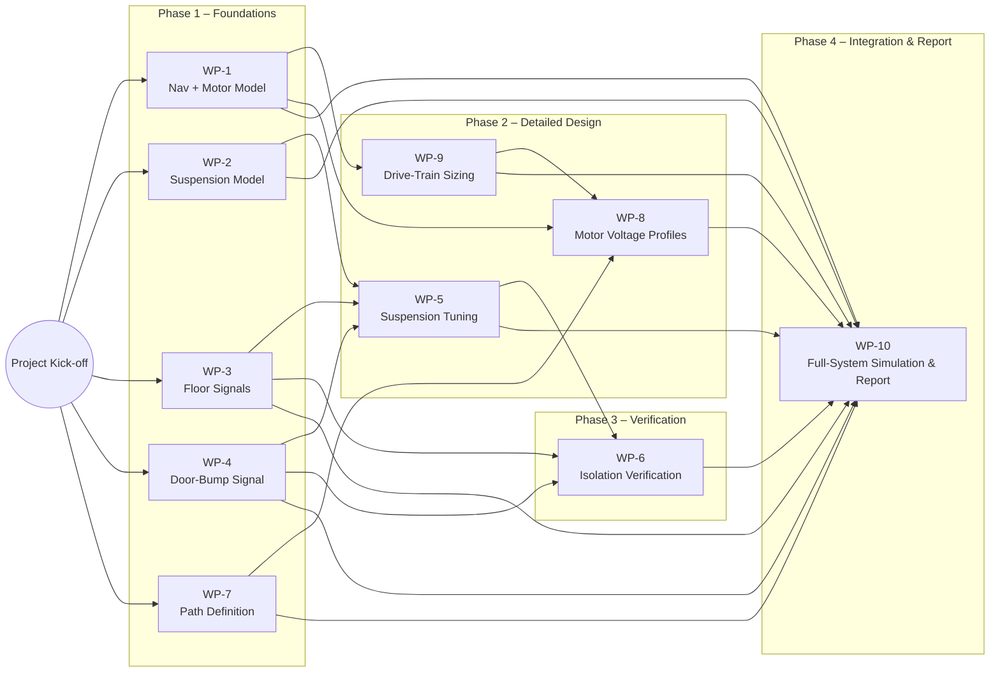

# Food-Serving Differential-Drive Robot – Project Breakdown

_Course: MTE 351 – Spring 2025_

## 1. Project Goal

Design, model, and simulate an indoor **food-serving robot** that can:

- Navigate a prescribed restaurant path quickly **without spilling** food/drinks.
- Absorb floor irregularities with a tuned suspension.
- Deliver a concise ≤ 10-page report (plus appendices) summarizing assumptions, models, results, and design insights.

---

## 2. Work Packages (WP)

| WP        | Focus                                | Core Tasks                                                                                                                                      | Key Deliverables                                                           |
| --------- | ------------------------------------ | ----------------------------------------------------------------------------------------------------------------------------------------------- | -------------------------------------------------------------------------- |
| **WP-1**  | **Coupled Navigation + Motor Model** | Implement planar kinematic + kinetic model of differential drive with DC motors in Simulink/Simscape.                                           | Block/physical diagrams; simulation file.                                  |
| **WP-2**  | **Suspension Sub-Model**             | Model spring-damper on each wheel (linear, 1 DOF each). Decide whether to couple to navigation model.                                           | Suspension schematic; Simscape or Simulink implementation.                 |
| **WP-3**  | **Floor Excitation Signals**         | Generate 5 m tiled-floor profile (1 ft tiles, 1 cm grout, 0.5 cm deep haversine).                                                               | MATLAB script/function; signal plot.                                       |
| **WP-4**  | **Door-Threshold Signal**            | Create 5 cm-long, 3 cm-high haversine bump signal.                                                                                              | MATLAB script; signal plot.                                                |
| **WP-5**  | **Suspension Parameter Tuning**      | Iterate wheel-spring stiffness & damping vs. planar velocity (≈ 3 m/s start). Ensure ≤ 0.5 cm drink displacement. Analyze full & minimum loads. | Trade-off graphs; chosen \(k\), \(c\), and allowable bump specs.           |
| **WP-6**  | **Isolation Verification**           | Simulate final design on all floor signals. Plot vertical force & acceleration at wheels.                                                       | Force & acceleration plots.                                                |
| **WP-7**  | **Path Definition**                  | Program straight-line + on-spot spin path from kitchen to table (see two spin points).                                                          | Path script/figure.                                                        |
| **WP-8**  | **Motor Voltage Profiles**           | Craft trapezoidal velocity-based voltage inputs for each wheel.                                                                                 | Voltage-time profiles; rationale.                                          |
| **WP-9**  | **Drive-Train Sizing**               | Choose/justify DC motor & gear ratio. Compute rms torque, accel/decel times, jerk.                                                              | Datasheet excerpt or assumed specs; sizing calculations; accel/jerk plots. |
| **WP-10** | **Full-System Simulation**           | Integrate all subsystems, run path trial, and record actual trajectory vs. desired.                                                             | Simulation file; XY-path plot; summary of performance.                     |

_(Tasks & deliverables paraphrased from project brief)_ :contentReference[oaicite:1]{index=1}

---

## 3. Suggested Team Roles (5 members)

| Role                              | Primary WPs                                       | Secondary Support |
| --------------------------------- | ------------------------------------------------- | ----------------- |
| **Navigation & Motors Lead**      | 1, 8, 9                                           | 10                |
| **Suspension & Vibration Lead**   | 2, 5, 6                                           | 3, 4              |
| **Signal & Path Planning Lead**   | 3, 4, 7                                           | 8                 |
| **Integration & Simulation Lead** | 10                                                | 1, 2              |
| **Documentation & QA Lead**       | Report compilation, diagrams, assumption tracking | All (peer review) |

_Rotate review duties so every member cross-checks at least one other WP._

---

## 4. Internal Milestones (example)

---

## 5. Shared Assets Repository Structure

/model
/navigation_motor
/suspension
/signals
/report
main.pdf
/figures
/scripts
generate_floor_signal.m
generate_threshold_signal.m

Use Git branching (`wp-1/nav-model`, `wp-2/suspension`, etc.) and pull requests for peer review.

---

## 6. Risk & Dependency Notes

- **Coupling**: Navigation ↔ Suspension coupling is optional but raises complexity; decide early.
- **Motor specs** impact voltage profiles and suspension tuning—keep WP-5 and WP-9 in sync.
- **Signal realism**: Floor/threshold profiles drive suspension design—verify amplitude units.
- **Tool paths**: Simulink models must use relative paths for portability in final submission. :contentReference[oaicite:2]{index=2}

---

## 7. Interdependencies

### Quick Next Steps for the Group

1. **Assign roles and WPs** (Section 3).
2. **Set up shared repo** with skeleton folders (Section 5).
3. **Lock initial assumptions** (robot geometry, wheel size, loads) in a shared `assumptions.md`.
4. **Kick-off WP-1/WP-2 modeling** so downstream tasks have early prototypes.

Good luck, and remember to keep the coffee _inside_ the cup!
